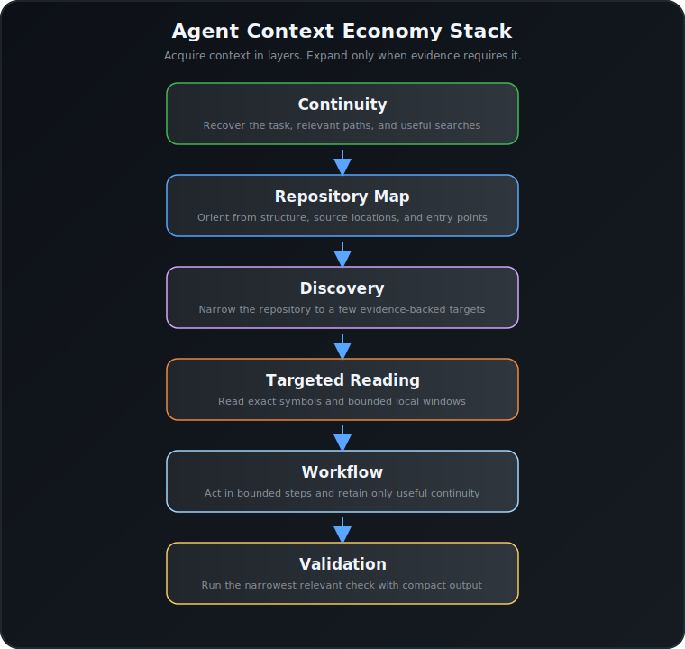
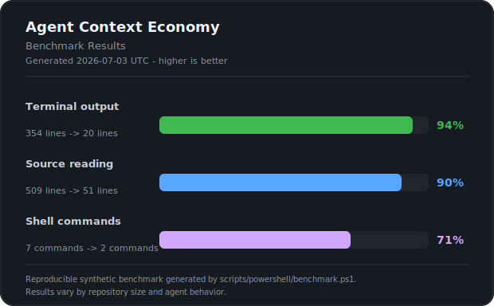
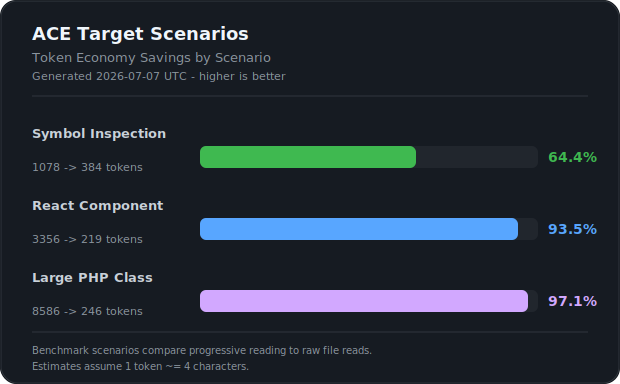

# Agent Context Economy (ACE)

<p align="center">
  
  
  
  
  
</p>

> Stop wasting model context on noisy terminal dumps, repeated repository discovery, and oversized source reads.

**Agent Context Economy is a methodology and reference implementation for context-efficient AI software development.** It helps agents preserve continuity, orient themselves quickly, discover deliberately, read the smallest useful source region, and validate changes without flooding the conversation.

ACE is designed for Windows repositories and works with coding agents such as Codex, Cursor, Windsurf, Claude Code, and Gemini. The methodology is tool-agnostic; the included scripts make it immediately usable without Node.js, Python, Rust, WSL, or Docker.

## The Agent Context Economy Stack

| Layer | Purpose | Primary helper |
| :--- | :--- | :--- |
| **Continuity** | Carry forward only the current task, useful searches, and relevant paths. | `session-state.ps1` |
| **Repository Map** | Establish structure, source locations, file counts, and likely entry points. | `repo-map.ps1` |
| **Discovery** | Narrow the repository to a few evidence-backed targets. | `investigate.ps1`, `search.ps1` |
| **Targeted Reading** | Read files and symbols progressively instead of dumping full source. | `read-symbol.ps1`, `read-text.ps1`, `read-window.ps1` |
| **Workflow** | Start compactly and move through bounded, informative steps. | `agent-start.ps1` |
| **Validation** | Keep tests, builds, diffs, and diagnostics useful but compact. | `run-compact.ps1`, `test.ps1` |

[](docs/workflow.svg)

Read the full [methodology](docs/methodology.md) for the principles and fallback rules behind the stack.

## Documentation

- [Why Agent Context Economy?](docs/why-agent-context-economy.md) — the recurring context-waste problems and the ACE response.
- [Methodology](docs/methodology.md) — the six-layer behavior model.
- [MCP and discovery-engine integration](docs/mcp-integration.md) — using ACE with repository-aware tools, AST indexes, semantic search, and MCP servers.
- [Source reading economy](docs/source-reading-economy.md) and [command budget](docs/command-budget.md) — operational policies.
- [v0.2.6 release notes](docs/releases/v0.2.6.md) — modularity, progressive retrieval, and context budgeting.
- [Changelog](CHANGELOG.md) — complete release history.

## Benchmark

[](benchmark-results/benchmark.svg)
[](benchmark-results/scenarios.svg)

| Metric | Conventional workflow | ACE workflow | Reduction |
| :--- | :---: | :---: | :---: |
| Terminal output | 354 lines | **33 lines** | **91%** |
| Source read | 509 lines | **40 lines** | **92%** |
| Shell commands | 7 commands | **2 commands** | **71%** |

This is a reproducible synthetic benchmark; results vary by repository and agent behavior. Run `scripts/powershell/benchmark.ps1` to inspect it locally.

### Explainable context reduction

ACE does not only shorten output. Compacted helper output includes a small provenance footer that makes the evaluated scope, exclusions, selection reason, reduction, and recommended next step visible. The goal is to reduce the risk of invisible selection bias without giving back the context savings.

Explainable context reduction is not a seventh ACE layer. It is a cross-cutting quality applied to compacting helpers across Discovery, Targeted Reading, and Validation, so the existing six-layer workflow remains unchanged.

## Toolkit

| Script | What it does |
| :--- | :--- |
| `repo-map.ps1` | Writes a lightweight Markdown repository map to `.agent-context/repo-map.md`, including git freshness metadata. |
| `session-state.ps1` | Maintains small, disposable continuity metadata in `.agent-context/session-state.json`. |
| `agent-start.ps1` | Prints a compact briefing from the map and session state. |
| `investigate.ps1` | Batches related searches into one structured discovery report. |
| `search.ps1` | Summarizes a repository search without dumping every match. |
| `find-in-file.ps1` | Finds an exact value within a known file. |
| `read-symbol.ps1` | Reads a named class, function, or method progressively (`-Summary`, `-Signature`, `-Body`, `-Full`) with abstract `-Budget` limits and smart truncation. |
| `read-text.ps1` | Reads files progressively (code files default to `-Summary` outline; non-code files default to `-Full`) with `-Budget` limits. |
| `read-window.ps1` | Reads a precise line window. |
| `run-compact.ps1` | Preserves useful diagnostics while compacting noisy command output. |
| `diff-summary.ps1` / `diff-file.ps1` | Provides focused Git change summaries. |
| `smoke-test.ps1` | Verifies the PowerShell helpers with lightweight local fixtures. |

Scripts inspect the repository read-only except for generated data under `.agent-context` or benchmark output under `benchmark-results`.

## Quick Start

From the repository where ACE is installed:

```powershell
# Setup environment and run smoke tests
.\scripts\powershell\setup-ai-scripts.ps1
.\scripts\powershell\smoke-test.ps1

# Establish repository overview
.\scripts\powershell\repo-map.ps1
.\scripts\powershell\session-state.ps1 set-task -Value "Refactor auth controller"
.\scripts\powershell\agent-start.ps1

# Progressive Reading: Summarize/Outline a code file (Default behavior)
.\scripts\powershell\read-text.ps1 -Path .\scripts\powershell\setup-ai-scripts.ps1

# Progressive Reading: Read a symbol signature with a small token budget (~400 tokens)
.\scripts\powershell\read-symbol.ps1 -Path .\scripts\powershell\read-symbol.ps1 -Symbol "Fail" -Signature -Budget Small
```

Copy the relevant policies from [examples/AGENTS.example.md](examples/AGENTS.example.md) into your project-level `AGENTS.md`, `CLAUDE.md`, `.cursorrules`, or equivalent instruction file.

The preferred workflow is:

```text
repo-map -> investigate -> read-symbol -> read-window -> run-compact
```

It is a decision path, not mandatory ceremony. Skip steps when the target is known, and use bounded raw exploration when a helper cannot express the query.

## Migration to v0.2.6 (Progressive Edition)

Version 0.2.6 introduces modular architecture and progressive reading modes to dramatically reduce LLM token usage:

1. **Modular Refactoring**: Common parsing, formatting, and truncation routines have been consolidated into `scripts/powershell/lib/ACE.*.ps1` (completely side-effect-free during dot-source).
2. **`read-text.ps1` Defaults**: Code files now default to `-Summary` mode (which outputs class/method/variable outline indexes) instead of dumping raw code. Non-code files default to `-Full`.
3. **`read-symbol.ps1` Defaults**: Containers (classes, interfaces) default to `-Summary`. Executables (methods, functions) default to `-Signature`.
4. **Context Budgeting**: Line limit constraints can be managed using abstract token budgets (`-Budget Small | Medium | Large`) for automatic truncation planning.
5. **Adaptive Command Recommendations**: All tool outputs now analyze their state and print the next recommended command (e.g. suggesting escalating from `-Signature` to `-Body` or jumping to a larger budget on truncation) under the `Next:` provenance field or guidance footer.

## Design Constraints

- **Windows PowerShell compatible**
- **No external dependencies**
- **Modularized helpers** (`scripts/powershell/lib/ACE.Parser.ps1`, `ACE.Formatting.ps1`, `ACE.Truncation.ps1`)
- **UTF-8 output** for generated files
- **Small, disposable state** with no source contents or secrets
- **Read-only repository inspection**, aside from `.agent-context` and `benchmark-results`

## Philosophy

The goal is not to blind the agent. The goal is to help it read a repository like a careful developer: summarize first, choose the exact target, read the smallest meaningful context, and expand only when evidence requires it.

See [docs/philosophy.md](docs/philosophy.md), [docs/source-reading-economy.md](docs/source-reading-economy.md), and [docs/command-budget.md](docs/command-budget.md).

## License

Distributed under the MIT License. See [LICENSE](LICENSE) for details.
