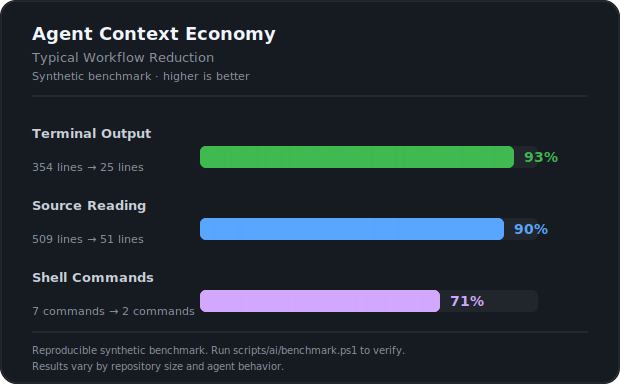

# 🤖 Agent Context Economy (ACE)

<p align="center">
  
  
  
  
</p>

### *Stop wasting LLM tokens on noisy terminal dumps and huge source files.*

**Agent Context Economy (ACE)** is a lightweight, drop-in PowerShell workflow toolkit designed specifically for AI coding agents (Cursor, Windsurf, Claude Code, GitHub Copilot Workspace, Antigravity). It forces agents to operate like senior developers: **investigate efficiently, read selectively, and act precisely.**

---
---

### 🚀 Quick Links
* [The Context Bleeding Problem](#the-context-bleeding-problem)
* [ACE Solution & Benchmarks](#the-ace-solution)
* [Included Toolkit](#included-toolkit--superpowers)
* [Quick Start](#quick-start-30-seconds)
* [Agent Instructions](#core-agent-instructions)
* [Philosophy](#the-philosophy)

---

## The Context Bleeding Problem

When AI agents navigate large repositories, they frequently burn through your context window (and your API wallet) by:
* 🛑 **Dumping 500+ lines** of raw Webpack/Vite/PHPUnit build logs just to see if a test failed.
* 🛑 **Reading entire 1,000-line source files** just to inspect a single 15-line function.
* 🛑 **Spamming recursive regex searches** that return hundreds of irrelevant matches.
* 🛑 **Triggering endless approval loops** for tiny, sequential shell commands.

### The ACE Solution

ACE acts as a smart abstraction layer between the agent and your repository, cutting context usage drastically:

[](docs/benchmark.svg)

| Metric | Conventional Workflow | ACE Workflow | 📉 Reduction |
| :--- | :---: | :---: | :---: |
| **Terminal Output** | 354 lines | **25 lines** | **-93%** |
| **Source Files Read** | 509 lines | **51 lines** | **-90%** |
| **Shell Commands** | 7 commands | **2 commands** | **-71%** |

---

## Included Toolkit & Superpowers

| Script | Command | Agent Superpower |
| :--- | :--- | :--- |
| 🤫 **Noise Control** | `run-compact.ps1` | Runs noisy builds/tests but only feeds errors/summaries to the agent. |
| 🎯 **Sniper Read** | `read-symbol.ps1` | Grabs *only* the specific class, function, or component context. |
| 🪟 **Windowing** | `read-window.ps1` | Reads a precise line range (e.g., lines 100-130) instead of the whole file. |
| 🕵️‍♂️ **Batch Inspect** | `investigate.ps1` | Batches multiple search patterns across paths into a single structured report. |
| 🔎 **Literal Find** | `find-in-file.ps1`| Fast literal search within a known file, avoiding regex confusion. |
| 🔀 **Smart Diff** | `diff-summary.ps1` | Provides a ultra-compact git status overview before commits. |

---

## Quick Start (30 Seconds)

1️⃣ **Clone & Install** inside your project repository:
```powershell
git clone [https://github.com/grafikerdem/agent-context-economy.git](https://github.com/grafikerdem/agent-context-economy.git)
powershell -ExecutionPolicy Bypass -File scripts/powershell/setup-ai-scripts.ps1
````
2️⃣ Run Smoke Test to verify everything is ready:

```powershell
.\scripts/powershell/smoke-test.ps1
````

3️⃣ Activate Agent Rules:
Copy the specialized prompts from examples/AGENTS.example.md into your project's .cursorrules, developer_instructions.md, or AGENTS.md file. This is where the magic happens—it teaches the agent to use these tools automatically!

## Core Agent Instructions

To get the most out of ACE, add these instructions to your `.cursorrules` or `AGENTS.md`:

```markdown
You have access to the Agent Context Economy (ACE) toolkit. 
Always prefer ACE scripts over raw commands:
1. Use `run-compact.ps1` for build/test output.
2. Use `read-symbol.ps1` or `read-window.ps1` for code inspection.
3. Use `investigate.ps1` to batch multiple search patterns.
4. If a file is long, never read the whole file; use `read-window.ps1`.

📖 Real-World Examples
1. Running Noisy Tests Without Token Dumps
Instead of flooding the chat with a massive test log, the agent runs this:

```powershell
.\scripts\powershell\run-compact.ps1 -Command "php artisan test" -MaxLines 250
````
Result: The agent only sees the final failure summary and stack traces.

2. Precise Code Inspection
Instead of reading a whole 800-line TypeScript controller:

```powershell
.\scripts\powershell\read-symbol.ps1 -Path resources/js/Pages/Checks/Create.tsx -Symbol "handleSubmit" -Context 30
````
## The Philosophy
The goal is not to blind the agent. The goal is to make it read code like a careful developer:

Summarize first.

Choose the exact target.

Read the smallest meaningful context.

Expand only when requested.

🤝 Contributing & License
We love efficiency! If you have a script that reduces token waste for Python, Node.js, Go, or any other framework, feel free to open a PR.

Distributed under the MIT License. See LICENSE for more information.
