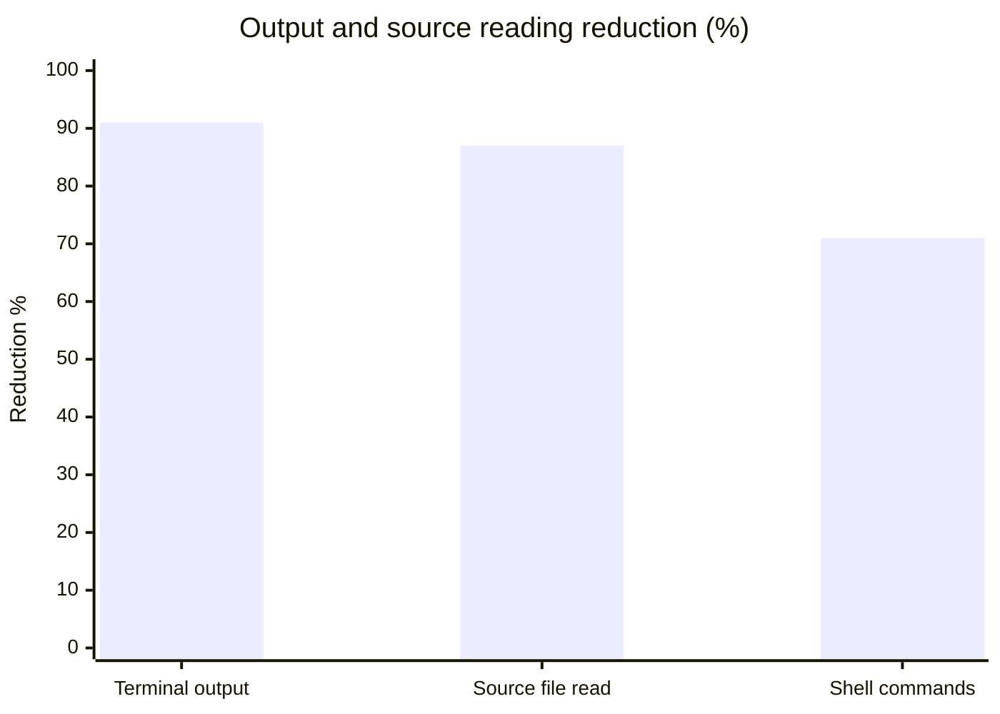
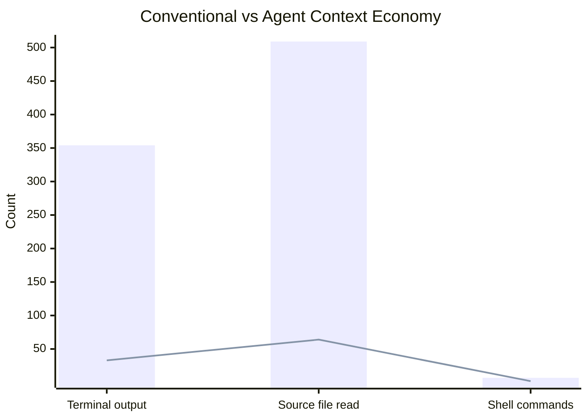

# Agent Context Economy Benchmark

## What does this toolkit reduce?

Typical benchmark results:

- **91% less terminal output**
- **87% less source code read**
- **71% fewer shell commands**

---

Reproducible synthetic benchmark generated by `scripts/powershell/benchmark.ps1`.
Run the script in any clone of this repository to reproduce these results.

Approximate token estimate:
1 token ~= 4 ASCII characters.

This is used only for relative comparisons. Actual token counts vary by model and tokenizer.

| Workflow | Conventional workflow | Agent Context Economy |
|---|---:|---:|
| Terminal output | 354 lines | 33 lines |
| Source file read | 509 lines | 64 lines |
| Shell commands | 7 commands | 2 commands |

## Reduction summary

| Metric | Reduction |
|---|---:|
| Terminal output | 91% |
| Source file read | 87% |
| Shell commands | 71% |

## Charts

### Output and source reading reduction

### Conventional vs agent workflow

---

> **Note:** Results vary depending on repository size, command output, and agent behavior.
> The benchmark is intended to compare workflow shape rather than absolute model token usage.
